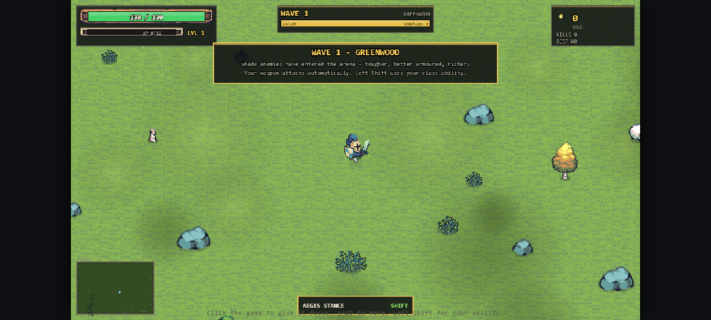
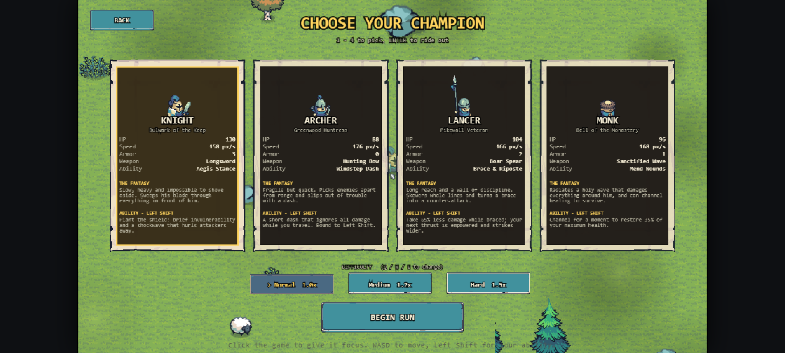
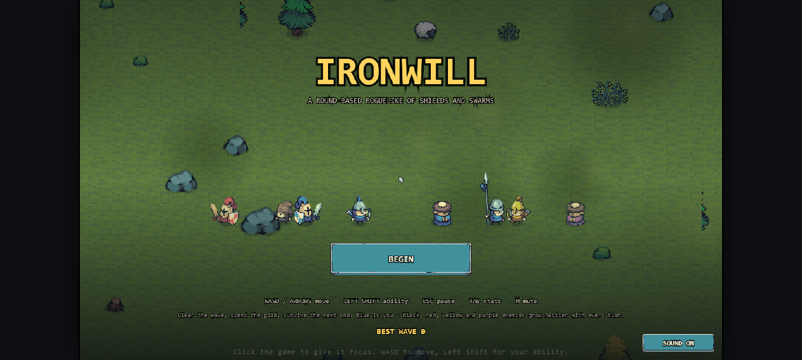
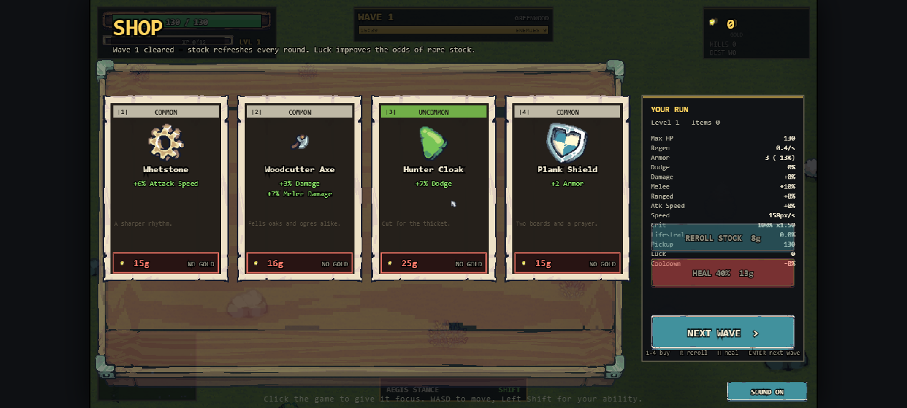

<p align="center">
  
</p>

<h1 align="center">⚔️ Ironwill</h1>

<p align="center">
  <em>A round-based action roguelike inspired by <strong>Brotato</strong> &amp; <strong>The Binding of Isaac</strong> — survive the horde, spend the gold, break the twenty-wave campaign.</em>
</p>

<p align="center">
  
  
  
  
  
  
</p>

---

## 🎮 Play it now

**▶ Play online:** <strong><a href="https://demak-o.github.io/Ironwill/">demak-o.github.io/Ironwill</a></strong> — hosted on GitHub Pages, no install needed.

Ironwill is **100% open-source, dependency-free, and runs straight in the browser** — no install, no build tools, no backend. To run it locally, just serve the folder over HTTP and open the page:

```bash
python -m http.server 8080      # or: npx serve .
```

Then open **<http://localhost:8080/>**, click the canvas once to give it keyboard focus, and dive in. Every sprite and sound ships right in the repo — the game plays fully offline.

> **Note:** the game loads its pixel art with `fetch`, so a plain `file://` double-click won't work — it needs any static HTTP server.

---

## ✨ Features

| | |
|---|---|
| 🌊 **Wave-based survival** | Clear each wave before the timer runs out. Gold and XP drop from the horde. |
| 🗡️ **Four classes, four builds** | Knight, Archer, Lancer and Monk — each with a unique weapon *and* a class ability. |
| 🎲 **Luck is a real stat** | Shift shop rarity toward Epic and Legendary drops and stack a godlike build. |
| 🛒 **Roguelike shop** | Four items per wave, rerollable (cost climbs every time), plus a heal booth. |
| 🌍 **Living biomes** | The arena palette shifts every few waves — Greenwood → Frostfell. |
| 🐑 **Hand-drawn pixel art** | Every sprite comes from the Tiny Swords asset pack (see Credits). |
| 🎛️ **No build step** | Classic `<script>` tags on a plain HTML5 canvas. Open the folder, read the code. |
| 🔊 **Procedural audio** | Generated WebAudio blips — no audio files at all. Mute with `M`. |

---

## 🖼️ Screenshots

| Class select | Title screen |
|:---:|:---:|
|  |  |

| In the arena | The shop |
|:---:|:---:|
|  |  |

---

## 🕹️ How it plays

1. **Pick a class.** Four options, each a different weapon and a different `Left Shift` ability.
2. **Clear the wave.** Enemies stream in for the round's duration (20s to 45s). Kill them and they pop **gold** and **XP** — walk near the gold to hoover it up.
3. **Wave clear.** A short summary of kills, gold and time.
4. **Shop.** Four randomly-rolled items appear. Rerolls cost `8` gold and climb `×1.6 + 2` each time.
5. **Level up.** Fill the XP bar and pick one of **three boons** (e.g. `+5 Luck`, `+8% Cooldown Reduction`, `+40 Pickup Range`).
6. **Repeat.** **Wave 20** is the finale — clear it to win the campaign, then push on in **endless mode** for as long as you survive.

Dying ends the run. The title screen remembers your best wave.

### 🎛️ Controls

| Input | Action |
| --- | --- |
| **Mouse** | Aim where you attack (cursor follows your aim) |
| **`Left Click` (hold)** | Attack toward the cursor |
| `W` `A` `S` `D` / arrows | Move |
| `Left Shift` / `Space` | Class ability |
| `1` – `4` | Pick a class |
| `R` | Reroll the shop |
| `H` | Buy a heal in the shop |
| `M` | Mute / unmute sound |
| `P` / `Esc` | Pause |
| `Enter` / `Space` | Confirm, start, advance |
| Mouse | Everything in the menus |

---

## 🧙 The four classes

All four come from the **blue** unit set. Every class has a distinct weapon *and* a distinct ability bound to `Left Shift`.

| Class | Sprite | Weapon | Ability |
| --- | --- | --- | --- |
| **Knight** | `Blue/Warrior` | *Longsword* — a wide melee arc that sweeps everything in front and knocks it back | **Aegis Stance** — brief invulnerability plus a shockwave that hurls attackers away |
| **Archer** | `Blue/Archer` | *Hunting Bow* — fast projectiles that fly toward your aim | **Windstep Dash** — a short dash that ignores all damage while you travel |
| **Lancer** | `Blue/Lancer` | *Boar Spear* — a narrow thrust that skewers a whole line | **Brace & Riposte** — take 65% less damage while braced, then empower your next thrust |
| **Monk** | `Blue/Monk` | *Sanctified Wave* — a burst of holy light at your aim point (within a 300 px cast range) | **Mend Wounds** — channel to restore 35% of max health |

Base stats differ per class — the Knight is a 130 HP tank with 3 armor, the Archer is an 88 HP glass cannon with 5% dodge, and so on. Each class also opens with a small bonus to its own damage type (melee / ranged / damage).

---

## ⚔️ Enemies — *colour = tier*

Blue is reserved for the player; the other four unit colours are the enemy tiers. Every tier shares five archetypes — colour is purely strength, so a purple **Peasant** hits far harder than a black **Man-at-Arms**. Each enemy wears a coloured **ring at its feet** so you can read its tier at a glance, and **Elites** are scaled up (+28% size, ×3 HP, ×4 gold) and ringed in gold.

| Tier | Colour | Name | HP | Damage | Gold | Unlocks |
| --- | --- | --- | --- | --- | --- | --- |
| 1 | **Black** | Shade | ×1.00 | ×1.00 | ×1.00 | wave 1 |
| 2 | **Red** | Crimson | ×1.35 | ×1.25 | ×1.80 | wave 3 |
| 3 | **Yellow** | Gilded | ×1.80 | ×1.50 | ×2.80 | wave 6 |
| 4 | **Purple** | Void | ×2.60 | ×1.85 | ×4.20 | wave 9 |

**Archetypes** — every tier fields all five:

- **Peasant** (`Pawn`) — chases you in cheap numbers.
- **Man-at-Arms** (`Warrior`) — slower, tanky, swings with a wind-up.
- **Bowman** (`Archer`) — keeps its distance and shoots (from wave 2).
- **Pikeman** (`Lancer`) — telegraphs, then charges across the screen (from wave 4).
- **Zealot** (`Monk`) — hangs back and heals nearby enemies (from wave 5).

The difficulty curve (`IW.waveConfig`) ramps enemy HP, damage and spawn pressure every wave — a quadratic HP curve keeps late waves punchy right up to the campaign's end, and loot scales with the tier, so a wave-20 Void Warrior funds the expensive late items.

---

## 📈 Stats, Luck & Items

Everything is a modifier on one stat sheet (`src/data/stats.js`): `Max HP`, `Regen`, `Armor`, `Dodge`, `Damage`, `Melee`, `Ranged`, `Attack Speed`, `Move Speed`, `Crit`, `Crit Damage`, `Lifesteal`, `Pickup Range`, `Luck`, `Cooldown`.

**Luck is a genuine stat** that appears in the HUD like any other — and it does exactly one thing: it shifts the shop's rarity table up.

Rarity weights are `base × (1 + LUCK_FACTOR[rarity] × luck)`:

| Rarity | Base weight | Per point of Luck |
| --- | --- | --- |
| Common | 100 | −0.55% |
| Uncommon | 52 | 0 |
| Rare | 20 | +3.5% |
| Epic | 6.5 | +6.0% |
| Legendary | 1.4 | +9.0% |

At 0 Luck the shop is overwhelmingly Common — a Legendary appears in a given slot only about **1 in 130** rolls. Stack Luck (items like `Lucky Coin` +3, `Fortuna Charm` +6, `Glittering Hoard` +10, `Crown of Avarice` +20, `Duck of Destiny` +12) and Legendary builds become genuinely reachable. There are 40+ items and level-up boons, and shop prices creep up 4% per wave so late gold finds somewhere to go.

---

## 🧱 Tech & repo layout

Plain **HTML5 Canvas + vanilla JavaScript**. No framework, no bundler, no `node_modules` — classic `<script>` tags in dependency order, so the whole game is readable by opening the project.

```
Ironwill/
├── index.html          canvas + script tags (order matters, no modules)
├── styles.css          page frame, loading bar
├── src/
│   ├── util.js         rng, lerp, hashing, weighted picks, seeded helpers
│   ├── assets.js       sprite manifest, sheet slicing, frame metadata
│   ├── audio.js        tiny WebAudio blips (no audio files)
│   ├── input.js        keyboard / mouse state
│   ├── data/           stats, characters, enemies, items
│   ├── entities.js     Player, Enemy, Projectile, Pickup, abilities
│   ├── arena.js        water border, grass field, decor placement, camera
│   ├── ui.js           every screen: title, select, HUD, shop, pause, results
│   └── game.js         the controller, state machine, main loop
├── Assets/             pixel art (Tiny Swords pack) + tilesets + UI plates
├── docs/screenshots/   README screenshots
└── tools/              dev-only inspection & test scripts
```

### ✅ Tests

A headless smoke test loads the real sources with a stubbed canvas and drives actual waves, shops and level-ups — checking the four classes, the tier/luck/difficulty formulas, the asset manifest, the full menu flow, and **full simulated runs per class** (plus a funded deep run and the victory path). Nothing may end up `NaN` or negative.

```bash
node tools/headless_test.js      # → prints "ALL CHECKS PASSED"
```

---

## 🙌 Credits & assets

- **Code & design** — released under the **MIT license** (see [LICENSE](LICENSE)).
- **Pixel art, tilesets & UI plates** — the **[Tiny Swords](https://cainos.itch.io/pixel-art-top-down-basic)** asset pack by **Cainos**, used under its own license and shipped **as-is**. It is **not** covered by this project's MIT license; please respect its terms if you reuse the art.

---

## 🚧 Status & contributing

Ironwill is in **open beta** — the full 20-wave campaign, endless mode, four classes and the shop are all in. It's free, open source and ready to play. Found a bug, a balance beef, or just want to say hi? Open an **[issue](https://github.com/Demak-o/Ironwill/issues)** or send a pull request.

<p align="center">
  <sub>Made with a mouse, a keyboard, and too much coffee. ☕</sub>
</p>
